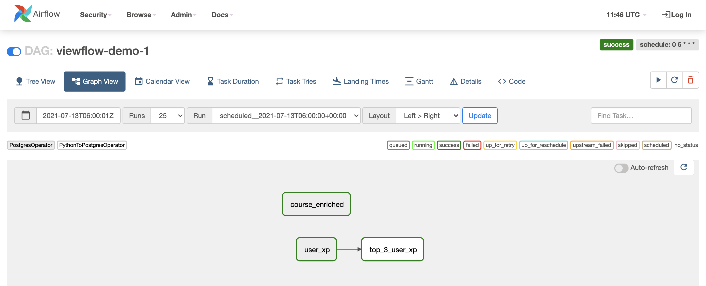

# Viewflow

Viewflow is a framework built on the top of Airflow that enables data scientists to create materialized views. It allows data scientists to focus on the logic of the view creation in their preferred tool (e.g., SQL, Python).

Viewflow automatically creates Airflow DAGs and tasks based on SQL or Python files. 

One of the major features of Viewflow is its ability to manage tasks' dependencies, i.e., views used to create another view. Viewflow can automatically extract from the code (SQL query or Python script) the internal and external dependencies. An internal dependency is a view that belongs to the same DAG as a view being created. An external dependency is a view that belongs to a different DAG. The benefits of automatic dependency management are twofold: First, data scientists don't have to manually list dependencies, usually an error-prone process. Second, it makes sure that no view is built on stale data (because all dependent views will be updated beforehand).

Currently, Viewflow supports SQL and Python views and PostgreSQL/Redshift as a destination. We will continue improving Viewflow by adding new view types (e.g., R, Jupyter Notebooks, ...) and destination (e.g., Snowflake, BigQuery, ...).

Do you want more context on why we built and released Viewflow? Check out our announcement blog post: [*Data Scientists, don’t worry about data engineering: Viewflow has your back.*](https://medium.com/datacamp-engineering/viewflow-fe07353fa068)!

## Viewflow demo

We created a demo that shows how Viewflow works. The demo creates two DAGs: `viewflow-demo-1` and `viewflow-demo-2`. These DAGs create a total of four views in a local Postgres database. Check out the view files in [demo/dags/](./demo/dags/). Some of the following commands are different based on which Airflow version you're using. For new users, Airflow 2 is the best option. However, you can also run the demo using the older Airflow 1.10 version by using the indicated commands.

### Run the demo 
We use `docker-compose` to instantiate an Apache Airflow instance and a Postgres database. The Airflow container and the Postgres container are defined in the `docker-compose-airflow<version>.yml` files. The first time you want to run the demo, you will first have to build the Apache Airflow docker image that embeds Viewflow:

```sh
docker-compose -f docker-compose-airflow2.yml build     # Airflow 2
docker-compose -f docker-compose-airflow1.10.yml build  # Airflow 1.10
```

Then run the docker containers:
```sh
docker-compose -f docker-compose-airflow2.yml up     # Airflow 2
docker-compose -f docker-compose-airflow1.10.yml up  # Airflow 1.10
```

Go to your local Apache Airflow instance on [http://localhost:8080](http://localhost:8080). There are two DAGs called `viewflow-demo-1` and `viewflow-demo-2`. Notice how Viewflow automatically generated these DAGs based on the example queries in the subfolders of [demo/dags/](./demo/dags/)!




By default, the DAGs are disabled. Turn the DAGs on by clicking on the button `Off`. This will trigger the DAGs.

### Query the views

Once the DAGs have run and all tasks completed, you can query the views created by Viewflow in the local Postgres database created by Docker. You can use any Postgres client (note that Postgres is running locally on port `5433`):

```sh
psql -h localhost -p 5433 -U airflow -d airflow
```

Use `airflow` when `psql` asks you for the user password.

There is a schema named `viewflow_raw` and a schema named `viewflow_demo`. The first one contains three tables: `users`, `courses`, and `user_course`. They are considered as the raw data. The second schema, `viewflow_demo`, is the schema in which the views created by Viewflow are stored. 

```sql
\dn

+---------------+---------+
| Name          | Owner   |
|---------------+---------|
| public        | airflow |
| viewflow_demo | airflow |
| viewflow_raw  | airflow |
+---------------+---------+
```

Viewflow created four views: `user_xp` (SQL), `user_enriched` (SQL), `course_enriched` (SQL) and `top_3_user_xp` (Python)

```sql
\dt viewflow_demo.

+---------------+-----------------+--------+---------+
| Schema        | Name            | Type   | Owner   |
|---------------+-----------------+--------+---------|
| viewflow_demo | course_enriched | table  | airflow |
| viewflow_demo | top_3_user_xp   | table  | airflow |
| viewflow_demo | user_enriched   | table  | airflow |
| viewflow_demo | user_xp         | table  | airflow |
+---------------+-----------------+--------+---------+
```

You can query these tables to see their data:
```sql
select * from viewflow_demo.user_xp;

+-----------+------+-----------------------+
| user_id   | xp   | __view_generated_at   |
|-----------+------+-----------------------|
| 1         | 750  | 2021-03-17            |
| 2         | 200  | 2021-03-17            |
| 3         | 550  | 2021-03-17            |
| 4         | 500  | 2021-03-17            |
| 5         | 650  | 2021-03-17            |
| 6         | 430  | 2021-03-17            |
| 7         | 300  | 2021-03-17            |
| 8         | 280  | 2021-03-17            |
| 9         | 100  | 2021-03-17            |
| 10        | 350  | 2021-03-17            |
+-----------+------+-----------------------+
```

You can also access the tables' comment (both table and columns):

```sql
select obj_description('viewflow_demo.user_enriched'::regclass) as view_description;

+---------------------------------------------+
| view_description                            |
|---------------------------------------------|
| A table with enriched information of users  |
+---------------------------------------------+
```

```sql
select
   column_name,
   col_description((table_schema||'.'||table_name)::regclass::oid, ordinal_position) as column_comment
 from
   information_schema.columns
 where
   table_schema = 'viewflow_demo'
 and
   table_name = 'user_enriched';

+--------------------------+-----------------------------------------------+
| column_name              | column_comment                                |
|--------------------------+-----------------------------------------------|
| user_id                  | The user id                                   |
| xp                       | The user amount of XP                         |
| last_course_completed_at | When was the last course completed by a user  |
| last_course_completed    | Name of the latest completed course by a user |
| number_courses_completed | Number of completed courses by a user         |
| __view_generated_at      | <null>                                        |
+--------------------------+-----------------------------------------------+
```

And that's it! Congrats on running the demo :rocket:  If you want to play more with Viewflow, follow the installation instructions below.

## Installation instructions

:envelope: *If you have any issue with the installation, configuration, or creation of your DAGs, do not hesitate to [contact us](./MAINTAINERS.md)!*


The current installation process requires you to install Viewflow from the GitHub repository:

```sh
RUN pip install git+https://github.com/datacamp/viewflow.git 
```

## Create a new DAG 
Viewflow creates the DAGs automatically based on configuration files.

Here are the steps to create a DAG for the first time.

### Create the Viewflow main script
In your Airflow DAG directory (usually `$AIRFLOW_HOME/dags`), create a python script called `viewflow-dags.py` that contains the following Python code:

```python
from viewflow import create_dags

DAG = create_dags("./dags", globals(), "<views_schema_name>")
```

This script is executed by Airflow. It calls the main Viewflow function that creates your DAGs. The first parameter is the directory in which your dag folders are located. The third parameter is the schema name in your data warehouse, where your views will be materialized.

### Create an Airflow connection to your destination
Viewflow needs to know where to write the views. It uses an Airflow connection that is referred to in the view files by specifying a `connection_id`. Currently, Viewflow supports Postgres (or Redshift) data warehouses. Please look at the [Airflow documentation](https://airflow.apache.org/docs/apache-airflow/stable/howto/connection.html) to create a Postgres connection.

E.g. the demo's connection is managed using environmemt variables declared in [demo/.env](./demo/.env). This file is the `env_file` specified in the `docker-compose-airflow<version>.yml` files and it allows the scheduler and webserver containers to connect to the Postgres server.

### Create your DAG directories

In Viewflow, the DAGs are created based on a configuration file and on the SQL and Python files in the same directory. 

In `$AIRFLOW_HOME/dags/`, create a directory called `my-first-viewflow-dag`. In this directory, create a `config.yml` file that contains the following yml fields:

```yml
default_args:
    owner: <owner>@dag.com
    retries: 1
schedule_interval: 0 6 * * *
start_date: "2021-01-01"
```
Adapt the values of each element to what suits you. The `default_args` element contains the Airflow [default DAG  parameters](https://airflow.apache.org/docs/apache-airflow/stable/tutorial.html#default-arguments).

The `schedule_interval` and `start_date` elements are the Viewflow counterparts of Airflow's `schedule_interval` and `start_date`. 

You can now add your SQL and Python files in this directory (see sections below). This will create a new DAG in Airflow called `my-first-viewflow-dag` that will be triggered every day at 6 AM UTC as of January 1, 2021. All failed tasks will be retried once.

### View metadata

Viewflow expects some metadata that must be included in the SQL and Python files (examples follow). Here are the fields that should be included in a `yml` format:

* **owner**: The owner of the view (i.e., who is view responsible). The owner appears in Airflow and allows users to know who they should talk to if they have some questions about the view.
* **description**: What is the view about. Viewflow uses this field as a view comment in the database. The description can be retrieved in SQL (see Section [*Query the views*](https://github.com/datacamp/viewflow#query-the-views)).
* **fields (list)**: Description of each column of the view. Viewflow uses these fields as column comments in the database. The column descriptions can be retrieved in SQL (see Section [*Query the views*](https://github.com/datacamp/viewflow#query-the-views)).
* **schema**: The name of the schema in which Viewflow creates the view. It's also used by Viewflow to create the dependencies.
* **connection_id**: Airflow connection name used to connect to the database (See Section [*Create an Airflow connection to your destination*](https://github.com/datacamp/viewflow#create-an-airflow-connection-to-your-destination)).

### SQL views

A SQL view is created by a SQL file. This SQL file must contain the SQL query (as a `SELECT` statement) of your view and the view metadata. Here's an example:

```sql
/* 
---
owner: name-of-the-view-owner
description: A description of your view. It's used as the view's description in the database
fields:
  email: Description of your column -- used as the view column's description in the database
schema: schema_name_in_your_destination (e.g. viewflow_demo)
connection_id: airflow_destination_connection
--- 
*/

SELECT DISTINCT email FROM viewflow_raw.users
```

### Python views

*Please note that the implementation of the Python view should be considered as beta. It is a newer implementation of the Python view that we use at DataCamp.*

A Python view is created based on a Python script. This script must contain at least one function with the view's description metadata in its docstring, which returns a Pandas dataframe.

Here's an example of a Python view:

```python
import pandas as pd

def python_view(db_engine):
    """
    ---
    owner: name-of-the-view-owner
    description: A description of your view. It's used as the view's description in the database
    fields:
        email: Description of your column -- used as the view column's description in the database
    schema: schema_name_in_your_destination (e.g. viewflow_demo)
    connection_id: airflow_destination_connection
    ---
    """
    df = pd.read_sql_table("users", db_engine, schema="viewflow_raw")
    return df[["email"]]
```

Please note that Viewflow expects the Python function that creates the view to have the parameter `db_engine` (used to connect to the database). You don't have to set `db_engine` anywhere. Viewflow takes care of setting this variable.

# Contributing to Viewflow

We welcome all sorts of contributions, be it new features, bug fixes or documentation, we encourage you to create a new PR. To create a new PR or to report new bugs, please read how to [contribute to Viewflow](CONTRIBUTION.md). 

In the remainder of this section, we show you how to prepare your environment to contribute to Viewflow.
## Install Poetry

See https://python-poetry.org/docs/#osx-linux-bashonwindows-install-instructions for comprehensive documentation.

`curl -sSL https://raw.githubusercontent.com/python-poetry/poetry/master/get-poetry.py | python`

## Install the dependencies


You can automatically install the required dependencies by running

```bash
poetry install
```

By default, this will install Airflow 2 and its corresponding dependencies. If you want to use Airflow 1.10, copy the [Airflow@1.10/pyproject.toml](./Airflow@1.10/pyproject.toml) file to the main directory.

## Prepare your environment to run the tests

### Postgres
Use docker compose to set up a PostgreSQL database locally (password: `passw0rd`):

```bash
docker-compose -f docker-compose-test.yml up
```

If you get a message saying that port 5432 is in use, it means you have a different PostgreSQL server running on your machine. If you used homebrew to install it, you could use `brew services stop postgresql` to stop the other server.

Import the fixtures into the local database:

```bash
psql -U user -W -h localhost -f tests/fixtures/load_postgres.sql -d viewflow
```

### Run Pytest

Before you can continue, you will need to set up an Airflow SQLite database.


```bash
poetry run airflow db init  # Airflow 2
poetry run airflow initdb   # Airflow 1.10
```

If running into problems, this [link](https://airflow.apache.org/docs/apache-airflow/stable/installation.html#troubleshooting) can be helpful. In particular, it's possible you get a `Symbol not found: _Py_GetArgcArgv` error. This is easily fixed by creating a Python virtual environment as demonstrated in the [link](https://airflow.apache.org/docs/apache-airflow/stable/installation.html#troubleshooting), activating this virtual environment and then running `poetry install` again.

Note for Airflow 1.10.12: if you get an `ImportError`, it can be helpful to refer to this [post](https://stackoverflow.com/questions/64891058/issue-on-airflow-initdb).

After setting up the database, run

```bash
poetry run pytest
```


In case the database connection is set up incorrectly, run

```bash
poetry run airflow db reset  # Airflow 2
poetry run airflow resetdb   # Airflow 1.10
```

## Viewflow architecture

We built Viewflow around three main components: the *parser*, the *adapter*, and the *dependency extractor*.

The *parser* transforms a source file (e.g., SQL, Rmd, Python) that contains the view's metadata (e.g., view's owner, view's descriptions, and column's descriptions) and the view's code into a specific Viewflow data structure. The data structure is used by the other components in the Viewflow architecture: the adapter and the dependency creator. 

The *adapter* is the translation layer of Viewflow's views to their corresponding Airflow counterpart. It uses the data structure objects created by the parser to create an Airflow task object (i.e., an Airflow operator).

Finally, the *dependency extractor* uses the parser's data structure objects to set the internal and external dependencies to the Airflow task object created by the adapter.

This architecture allows us to add new source file types in the future easily (e.g., Python notebook, R markdown).

# Acknowledgments 

Today's version of Viewflow is the result of a joint effort of ex and current DataCampers. We would like to thank in particular the following persons who significantly contributed to Viewflow:
- [David Robinson](https://github.com/dgrtwo)
- [Anthony Baker](https://github.com/bakera81)
- [Michael Chow](https://github.com/machow)
